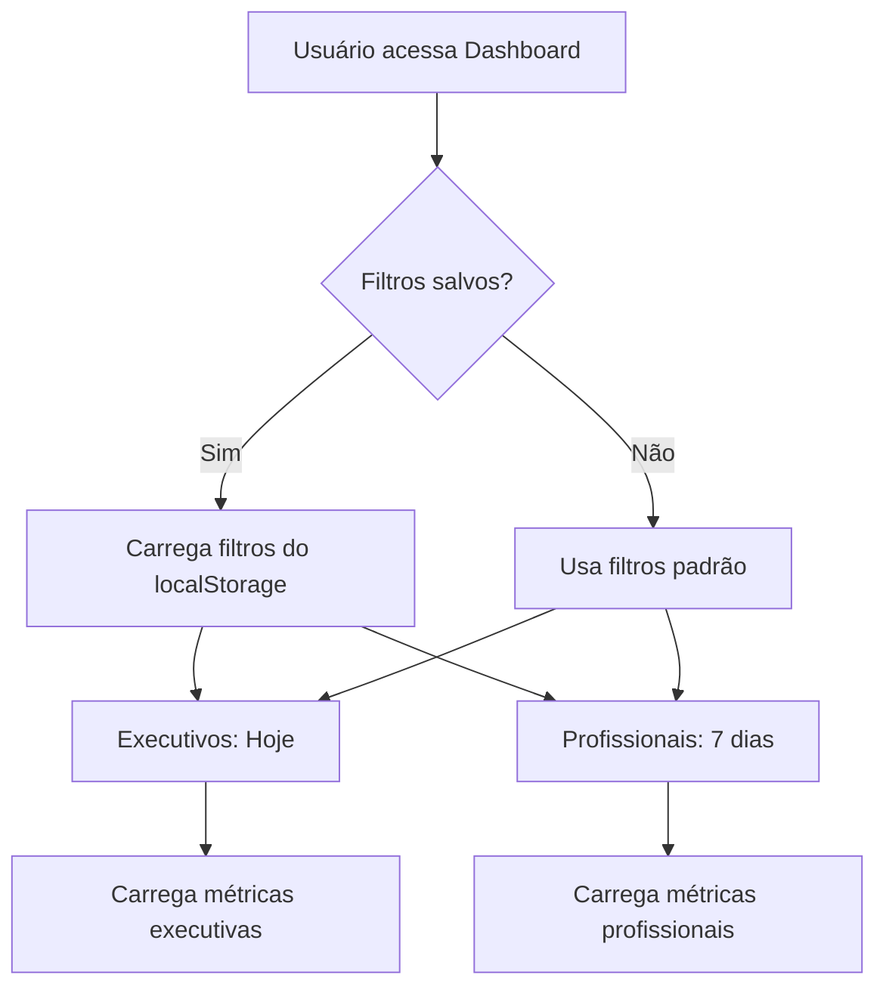
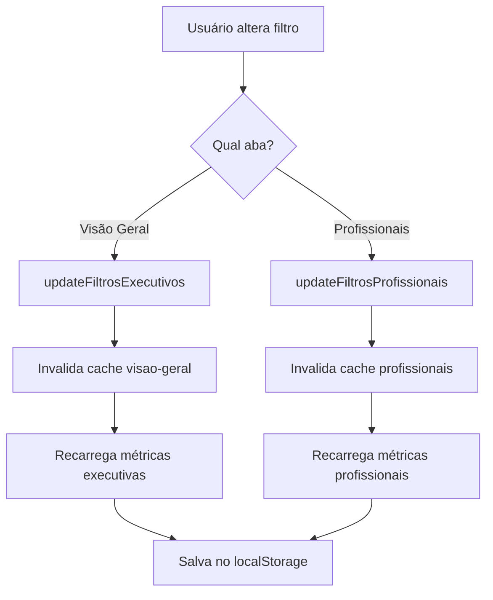
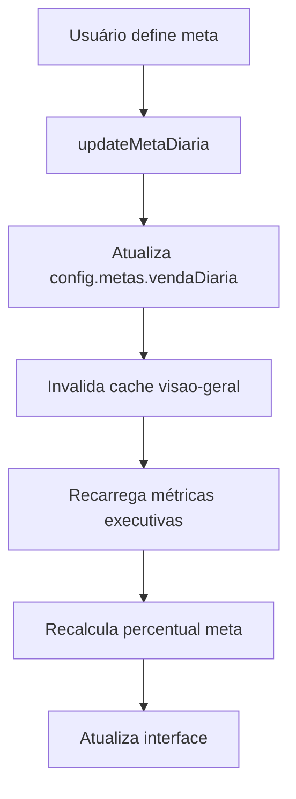

# FASE 2.2: Filtros na Aba Visão Geral - Progresso Concluído ✅

## 🎯 **NOVO COMPONENTE DE FILTROS EXECUTIVOS**

### **Arquivo Criado**: `src/components/dashboard/FiltrosExecutivos.tsx`

#### **Interface Especializada para Métricas Executivas:**

##### 📅 **Períodos Pré-definidos Executivos**
```typescript
const PERIODOS_EXECUTIVOS: PeriodoPresetExecutivo[] = [
  { label: 'Hoje', icon: '📅', descricao: 'Métricas do dia atual' },
  { label: 'Ontem', icon: '⏮️', descricao: 'Métricas do dia anterior' },
  { label: 'Esta semana', icon: '📊', descricao: 'Do domingo até agora' },
  { label: 'Últimos 7 dias', icon: '📈', descricao: 'Últimos 7 dias completos' },
  { label: 'Este mês', icon: '🗓️', descricao: 'Do 1º dia do mês até agora' },
  { label: 'Últimos 30 dias', icon: '📉', descricao: 'Últimos 30 dias completos' }
]
```

##### 💰 **Metas Pré-configuradas**
```typescript
const METAS_SUGERIDAS = [
  { label: 'R$ 1.000', valor: 1000 },
  { label: 'R$ 2.500', valor: 2500 },
  { label: 'R$ 5.000', valor: 5000 },
  { label: 'R$ 7.500', valor: 7500 },
  { label: 'R$ 10.000', valor: 10000 },
  { label: 'R$ 15.000', valor: 15000 }
]
```

##### 🎨 **Design Executivo Premium**
- **Header compacto**: Informações essenciais sempre visíveis
- **Layout responsivo**: Grid 2 colunas (períodos + metas/config)
- **Chips informativos**: Quantidade de dias, meta atual
- **Visual premium**: Gradiente, bordas, efeitos hover
- **Ícones contextuais**: Material Icons + emojis para clareza

#### **Funcionalidades Avançadas:**

##### 🔄 **Auto-aplicação Inteligente**
- **Aplicação instantânea**: Mudanças aplicam automaticamente
- **Persistência**: Salva preferências no localStorage
- **Validação**: Períodos sempre válidos
- **Feedback visual**: Loading states e confirmações

##### ⚙️ **Configurações de Auto-refresh**
```typescript
<Select value={config.autoRefresh.enabled ? config.autoRefresh.interval : 0}>
  <MenuItem value={0}>Desabilitado</MenuItem>
  <MenuItem value={1}>1 minuto</MenuItem>
  <MenuItem value={3}>3 minutos</MenuItem>
  <MenuItem value={5}>5 minutos</MenuItem>
  <MenuItem value={10}>10 minutos</MenuItem>
  <MenuItem value={30}>30 minutos</MenuItem>
</Select>
```

## 🔧 **HOOK MODULAR ATUALIZADO**

### **Arquivo Modificado**: `src/hooks/useDashboardModular.ts`

#### **Estados de Filtros Separados:**

##### **Filtros Especializados por Contexto**
```typescript
// Estados de filtros separados
const [filtrosProfissionais, setFiltrosProfissionais] = useState<FiltroAvancado>(getDefaultFiltersProfissionais())
const [filtrosExecutivos, setFiltrosExecutivos] = useState<FiltroAvancado>(getDefaultFiltersExecutivos())
```

##### **Funções de Atualização Independentes**
```typescript
// Para profissionais (7 dias padrão)
const updateFiltrosProfissionais = useCallback(async (novosFiltros: Partial<FiltroAvancado>) => {
  const filtrosAtualizados = { ...filtrosProfissionais, ...novosFiltros }
  setFiltrosProfissionais(filtrosAtualizados)
  cache.invalidateByTag('profissionais', true)
  refreshTab('profissionais')
}, [filtrosProfissionais, cache])

// Para executivos (hoje padrão)  
const updateFiltrosExecutivos = useCallback(async (novosFiltros: Partial<FiltroAvancado>) => {
  const filtrosAtualizados = { ...filtrosExecutivos, ...novosFiltros }
  setFiltrosExecutivos(filtrosAtualizados)
  cache.invalidateByTag('visao-geral', true)
  refreshTab('visao-geral')
}, [filtrosExecutivos, cache])

// Para metas
const updateMetaDiaria = useCallback(async (meta: number) => {
  const novaConfig = { ...config, metas: { ...config.metas, vendaDiaria: meta } }
  setConfig(novaConfig)
  cache.invalidateByTag('visao-geral', true)
  refreshTab('visao-geral')
}, [config, cache])
```

#### **Persistência Inteligente:**

##### **LocalStorage Separado por Contexto**
```typescript
// Salvamento separado
useEffect(() => {
  localStorage.setItem('dashboard_filters_profissionais', JSON.stringify(filtrosProfissionais))
}, [filtrosProfissionais])

useEffect(() => {
  localStorage.setItem('dashboard_filters_executivos', JSON.stringify(filtrosExecutivos))
}, [filtrosExecutivos])
```

##### **Carregamento Inicial**
```typescript
// Carregar filtros salvos
const savedFiltersProfissionais = localStorage.getItem('dashboard_filters_profissionais')
const savedFiltersExecutivos = localStorage.getItem('dashboard_filters_executivos')
```

## 🎨 **INTERFACE INTEGRADA**

### **Arquivo Atualizado**: `src/components/dashboard/DashboardModular.tsx`

#### **Integração Contextual por Aba:**

##### **Aba Visão Geral com Filtros Executivos**
```typescript
case 'visao-geral':
  return (
    <Box>
      {/* Filtros Executivos para Visão Geral */}
      <FiltrosExecutivos
        periodo={filtrosExecutivos || defaultPeriod}
        metaDiaria={config.metas?.vendaDiaria}
        config={config}
        onPeriodoChange={updateFiltrosExecutivos || (() => {})}
        onMetaChange={updateMetaDiaria || (() => {})}
        onConfigChange={updateConfig}
        loading={loading.executivas}
      />
      
      {/* Cards Executivos */}
      <CardsExecutivos 
        metrics={metrics.executivas}
        loading={loading.executivas}
        config={config}
      />
    </Box>
  )
```

##### **Aba Profissionais com Filtros Avançados**
```typescript
case 'profissionais':
  return (
    <Box>
      {/* Filtros Avançados para Profissionais */}
      <FiltrosAvancados
        filtros={filtros || defaultFilters}
        onFiltrosChange={updateFiltros || (() => {})}
        loading={loading.profissionais}
      />
      
      {/* Aba de Profissionais */}
      <AbaProfissionais 
        metrics={metrics.profissionais}
        loading={loading.profissionais}
        config={config}
      />
    </Box>
  )
```

## 📊 **FLUXO DE FUNCIONAMENTO**

### **1. Inicialização Inteligente**


### **2. Atualização de Filtros**


### **3. Atualização de Meta**


## 🎯 **Resultados Alcançados**

### ✅ **Experiência do Usuário**
- **Filtros contextuais**: Específicos para cada tipo de análise
- **Aplicação instantânea**: Sem botões "Aplicar", mudanças automáticas
- **Persistência inteligente**: Preferências salvas por contexto
- **Feedback visual**: Estados de loading, confirmações
- **Design premium**: Interface elegante e funcional

### ✅ **Performance e Eficiência**
- **Cache independente**: Invalidação específica por aba
- **Estados separados**: Sem conflitos entre contextos
- **Carregamento otimizado**: Só recarrega dados necessários
- **Persistência eficiente**: LocalStorage separado

### ✅ **Funcionalidades Avançadas**
- **6 períodos pré-definidos**: Do dia atual aos últimos 30 dias
- **6 metas sugeridas**: De R$ 1.000 a R$ 15.000
- **Meta personalizada**: Campo livre para qualquer valor
- **Auto-refresh configurável**: 6 opções de intervalo
- **Períodos personalizados**: Datetime picker completo

## 📈 **Impacto nas Métricas**

### **Antes vs Agora:**

#### **Aba Visão Geral:**
- ❌ **Antes**: Métricas fixas do dia atual
- ✅ **Agora**: Período configurável + meta personalizada

#### **Aba Profissionais:**
- ❌ **Antes**: Filtros genéricos compartilhados
- ✅ **Agora**: Filtros especializados para análise profissional

#### **Performance:**
- ❌ **Antes**: Cache único, invalidação global
- ✅ **Agora**: Cache contextual, invalidação específica

## 🚀 **Próximos Passos - FASE 3**

### **Pronto para implementar:**
- ✅ Filtros executivos funcionando
- ✅ Integração com serviço de estatísticas
- ✅ Interface premium implementada
- ✅ Persistência e performance otimizadas

### **Próxima etapa: Métricas Comparativas Reais**
- Implementar aba "Comparativos" com dados reais
- Sistema de análise temporal avançada
- Comparações inteligentes automáticas
- Insights e recomendações baseadas em dados

**Status: FASE 2.2 TOTALMENTE CONCLUÍDA - Pronto para FASE 3** 🎉 